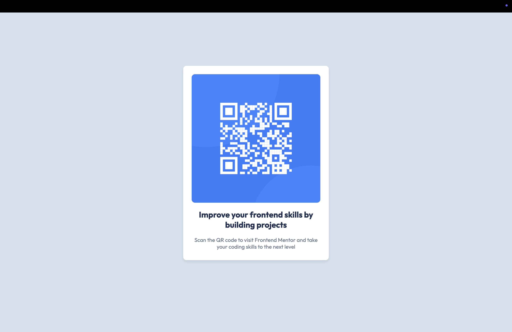

# QR Code Component

This is a solution to the [QR code component challenge on Frontend Mentor](https://www.frontendmentor.io/challenges/qr-code-component-iux_sIO_H). Frontend Mentor challenges help you improve your coding skills by building realistic projects.

## Table of Contents

- [Overview](#overview)
  - [Screenshot](#screenshot)
  - [Links](#links)
- [My Process](#my-process)
  - [Built With](#built-with)
  - [Useful Resources](#useful-resources)

## Overview

### Screenshot

### Links

- Live Site URL: [QR Code Component on Netlify](https://dulcet-pony-f01b5d.netlify.app/)

## My Process

### Built With

- Semantic HTML5 markup
- CSS custom properties
- Flexbox
- Mobile-first workflow
- [Codeium Cascade](https://codeium.com/cascade) via Windsurf - AI pair programming assistant
- Deployed with [Netlify](https://www.netlify.com/)

### Useful Resources

- [Codeium Cascade](https://codeium.com/cascade) (accessed through Windsurf) was invaluable for this project. I prompted it to be my HTML & CSS tutor since I hadn't practiced in a long time. It guided me through the steps without writing the code for me, acting like a senior developer providing guidance. The experience was enhanced by how easily I could deploy the GitHub repository to Netlify with Cascade's assistance.
